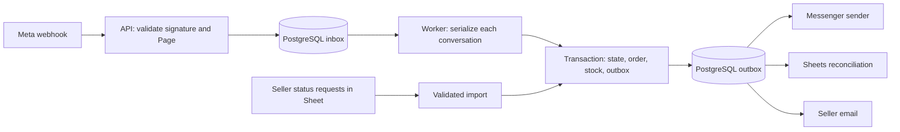

# TindaBot production review and implementation plan

Reviewed: 2 October 2026  
Baseline: [03_TindaBot_Blueprint.md](../03_TindaBot_Blueprint.md), version 1.0  
Status: design reviewed; implementation and production validation have not started.

## 1. Assessment and scope

The workspace contains only the blueprint. There is no application, dependency lockfile, migration, deployment configuration, or test suite to inspect or execute. Findings below are design risks, not observed runtime defects. Provider accounts and deployed resources were not inspected.

The product scope is suitable for a small first release: one Facebook Page, guided checkout, deterministic FAQ replies, PostgreSQL order storage, and Google Sheets for seller operations. Keep FastAPI, a pure conversation state machine, integer monetary amounts, price snapshots, signature verification, and PSID ownership checks.

The blueprint is a useful prototype specification, but it is not a production release specification. Its proposed acknowledgement and background-task lifecycle can lose accepted events; its data ownership and external retry behavior need concrete contracts. The estimated 5–7 days should be treated as a prototype estimate.

Planning assumption: one developer, one seller/Page, 10–500 conversations/day, no payment processing, and a supervised first launch. Proposed production effort is **22–30 engineering days plus a five-business-day pilot**, with external approval lead time tracked separately. These are planning estimates, not delivery commitments.

## 2. Findings, in priority order

P0 means required before accepting real customer orders. P1 means required for a supported public launch; it may be completed during a closely supervised pilot only where explicitly agreed.

| ID | Priority | Blueprint evidence | Failure scenario and required correction |
|---|---|---|---|
| R1 | P0 | Section 7, lines 220–223; section 10.8, line 466 | Returning 200 before an in-process task persists the event lets a restart permanently lose an acknowledged message. Commit a durable inbox record before acknowledgement; return a retryable error if persistence fails. |
| R2 | P0 | Section 10.7, lines 455–458; section 9, lines 335–336 | If the processed marker commits before business work, a crash makes retries skip unfinished work. A message ID also does not prevent two distinct confirmation clicks creating two orders. Commit event completion, conversation state, order, and outbox together; add a unique checkout confirmation key. |
| R3 | P0 | Section 10.7, line 458; section 12, lines 529–530 | A Sheet append can succeed while its response is lost; blind retry creates another row. An email can fail after the Sheet succeeds, leaving no pending flag for email. Track each destination independently, reconcile uncertain writes, and expose failed work. |
| R4 | P0 | Sections 5/W5–W6; section 9, line 381; section 17, line 650 | Tracking reads Sheet status while the design also calls the DB the source of truth. Sheet outages or conflicting edits produce stale or contradictory status. Read tracking from PostgreSQL and import seller status commands through a validated, versioned path in the first release. |
| R5 | P0 | Section 5/W3; section 10.5, line 436; phase 10.3, line 721 | Checking Sheet stock without transactional decrement lets two customers buy the last unit. Move inventory allocation into the order transaction, or explicitly launch with seller-confirmed availability and no stock guarantee. The default plan below includes allocation. |
| R6 | P0 | Section 9, line 304; section 10.3, line 412; section 10.7, line 457 | A queued reply can outlive the messaging window. Updating last-seen time from echoes or replayed events can incorrectly extend it. Check permission at dispatch using qualifying customer-event timestamps; distinguish transient errors, throttling, permanent errors, and uncertain delivery. |
| R7 | P0 | Section 9, line 372; section 13, line 548; phase 7.6, line 706 | Retention covers order fields but omits conversation drafts, customer prefill, webhook payloads, Sheets, email, and future attachments. Define retention and deletion across all copies before collecting production PII; do not treat a default 365 days as an approved legal requirement. |
| R8 | P0 | Section 15, lines 614–617; section 16, line 636 | Migrations in every process start can race during deployment. Pooler mode, backups, and restore procedures are unspecified. Use one migration release step, explicit connection settings, and a tested backup/restore path. |
| R9 | P0 | Section 5/W4; phase 10.4, line 722 | A seller replying without a prior customer handover request can race with bot replies. Include seller-reply detection or a seller-operated pause workflow that is usable without developer access. Re-check pause state immediately before queued replies are dispatched. |
| R10 | P1 | Section 10.8, line 468; section 10.5, line 437 | Requiring Sheets for API readiness turns a recoverable integration outage into an intake outage. In-memory limits and caches also diverge across processes. Separate intake readiness from integration health and use shared rate-limit/cache-version state. |
| R11 | P1 | Section 5/W6; section 10.8, line 472 | An unspecified `onEdit` trigger is insufficient for authenticated HTTP callbacks. Use an authorized installable trigger if callbacks are adopted, a narrowly scoped credential, version checks, and reconciliation for missed edits. |
| R12 | P1 | Section 9, line 320; section 10.4, lines 415–419 | Four base32 characters provide only 20 random bits; the code must never authorize access. Short fuzzy keywords such as `hm` and `sf` can match unrelated text. Use a longer unique code with collision retry, enforce ownership, and test phrase/token-aware intent matching. |

R1 is an architectural inference from the proposed sequence: FastAPI documents background tasks as work run after returning a response; this does not supply a durable inbox. [FastAPI background tasks](https://fastapi.tiangolo.com/tutorial/background-tasks/).

For R11, simple triggers cannot call services requiring authorization; installable triggers can, run as their creator, and are not triggered by normal API writes. [Simple trigger restrictions](https://developers.google.com/apps-script/guides/triggers), [installable triggers](https://developers.google.com/apps-script/guides/triggers/installable).

## 3. Production architecture and contracts

Use one codebase with two long-running processes: an HTTP API and a worker. PostgreSQL holds durable jobs, so a separate broker is unnecessary at the proposed scale. A scheduler in the worker creates uniquely keyed maintenance jobs; multiple worker instances must not schedule duplicate logical jobs.

### Event intake and processing

1. Bound request size; verify HMAC on raw bytes with constant-time comparison. Validate the webhook object and configured Page ID before accepting business events.
2. Persist the complete supported event batch in one transaction. Store event type, Page ID, sender identity, provider timestamp, receipt timestamp, deduplication key, payload, processing state, attempts, and next-attempt time. Classify unsupported events explicitly and retain only minimal diagnostic metadata.
3. Return 200 only after the transaction commits. Duplicate deliveries are successful no-ops. Return 503 when durable acceptance is unavailable; reject invalid signatures. Document malformed signed-payload handling to avoid an endless poison-event retry loop.
4. Use Page ID + provider event ID where available. Define event-type-specific keys for supported events without IDs from verified fixtures; never use a nullable `mid` as a universal key or assume all text-identical messages are duplicates.
5. Upsert the customer/conversation safely, lock the conversation, then select its earliest eligible pending event. A simple `SKIP LOCKED` across all events does not by itself preserve per-customer order. Process different customers concurrently; serialize each customer's state changes and outgoing reply sequence.
6. Record a durable receipt sequence and handle late provider events explicitly. Reject stale checkout actions using a draft ID/version; timestamps alone cannot guarantee real-world ordering.
7. Commit conversation state, order/inventory effects, inbox completion, and outbox entries atomically. Do not hold the business transaction open during HTTP, Sheets, or SMTP calls.
8. Recover abandoned worker claims after a lease expires. Bound retries, quarantine poison work, and support audited operator replay. A failed conversation event blocks or explicitly resolves later dependent events instead of silently skipping ahead.

PostgreSQL documents `SKIP LOCKED` as suitable for avoiding contention among consumers of a queue-like table. The per-conversation ordering rules above are additional application requirements. [PostgreSQL SELECT locking](https://www.postgresql.org/docs/current/sql-select.html).

### Orders, inventory, and confirmation

- Generate a server-side `checkout_id`; bind confirmation to its current draft version. Enforce a DB unique constraint on that checkout ID, independent of webhook deduplication retention.
- Recalculate all totals from a validated catalog snapshot. If price, shipping, or payment instructions changed after the displayed summary, show the new summary and require a new confirmation.
- Allocate stock with conditional updates inside the order transaction. Lock multiple SKUs in a consistent order; roll back the entire order if any item is unavailable.
- Keep availability in PostgreSQL. Import initial stock once; subsequent seller stock changes become uniquely keyed adjustments, not repeated overwrites from a stale Sheet value. Do not allow catalog refresh to restore already sold stock.
- Define stock release for cancellations and expired unpaid reservations. Release exactly once; choose payment reservation duration with the seller. If the seller also sells elsewhere, document the allocation reserved for this bot and how external sales reduce it.
- Separate fulfillment status from payment status. A payment instruction or uploaded screenshot does not establish payment. COD orders can ship while unpaid; only an authorized seller action records payment verification.
- Use a longer public code, for example eight random base32 characters, with a uniqueness constraint and bounded collision retry. Tracking always filters by authenticated sender PSID and configured Page.

### External delivery and Sheets ownership

- Give every external effect a unique business key, destination, state, attempts, next-attempt time, lease, and redacted last error. Distinguish `pending`, `delivered`, `retryable`, `uncertain`, `permanent_failure`, and `suppressed` outcomes.
- The DB guarantees one committed order per checkout. Messenger, SMTP, and Sheet writes do not share that transaction; do not promise exactly-once external delivery.
- A timeout after a write may mean the provider accepted it. Use reconciliation or provider-supported idempotency where available; otherwise apply a documented bounded retry/manual-review policy that acknowledges possible duplicate notifications.
- Treat the Orders tab as a DB projection. Serialize Sheet exports; on an uncertain append, search the protected order-ID column before retrying. Reconcile duplicate/missing rows. Never use an editable row number as permanent order identity or claim read-before-append guarantees uniqueness.
- Protect system columns and use separate seller-editable `requested_status` and notes fields. Include `order_id`, current status, `status_version`, and `sync_error`. Preserve pending seller requests when refreshing projections.
- For the initial release, poll pending seller requests every 60 seconds, validate them against DB status/version, apply accepted transitions, and publish the result. Record the consumed request fingerprint/version so polling is idempotent. Re-read pending cells before clearing them so a concurrent edit is not lost.
- Treat manual Sheet edits as an eventually reconciled command interface, not a transactional audit of every intermediate keystroke. Invalid/conflicting commands remain visible with an error. Use an authenticated versioned command endpoint if stronger ordering becomes necessary.
- Tracking reads DB status. Proactive status messages can remain deferred; status import itself is required at launch.
- Write customer-supplied cells with `RAW`, preserve phone numbers as text, and test formula-looking notes and names. Google documents that `RAW` values are stored without parsing. [Sheets value input options](https://developers.google.com/workspace/sheets/api/reference/rest/v4/ValueInputOption).
- Batch Sheet reads/writes, back off on throttling, and keep a durable last-known-good catalog with a version and maximum allowed age. Invalid imports retain the prior snapshot and alert the seller/operator. [Sheets quotas and backoff](https://developers.google.com/workspace/sheets/api/limits).

### Messaging and handover

- Store `last_customer_message_at` separately from receipt time and general activity. Qualifying event types must be checked against the selected Graph API version; echoes, delivery receipts, and replays must not extend the window.
- Check the messaging window, pause state, superseded draft/reply status, and opt-out state immediately before dispatch and every retry. Suppress expired replies without losing the order or seller notification.
- Retry throttling and known transient failures with bounded exponential backoff and jitter, respecting provider guidance. Pause sending and alert on invalid credentials or permissions; do not classify all HTTP 4xx as permanent without examining the provider error.
- Ignore own application echoes for conversation input. Verify seller-echo identification using real Page fixtures before enabling automatic pause; do not assume a missing field reliably proves a human sent it.
- Include a global automation kill switch, per-conversation pause/resume, and a seller-usable handover procedure. Explicit customer return to the bot resumes automation; timeout-based resume must be agreed with the seller.
- Keep `gspread` and SMTP work outside the async API event loop, using worker threads or suitable worker execution. Handover and order notifications have independent delivery state.

Meta's maintained API collection documents Page tokens, `pages_messaging`, and the standard 24-hour messaging condition. Use that baseline and revalidate exact qualifying events and access requirements before launch. [Meta Messenger API collection](https://www.postman.com/meta/messenger-platform-api/documentation/iyp204x/messenger-platform-api).

### Minimum schema additions

| Area | Required additions |
|---|---|
| Inbox | `inbound_events`: unique event key, payload/type, Page/customer, receipt sequence, timestamps, processing state, retry/lease metadata |
| Outbox | `outbound_jobs`: unique business key, destination, order/conversation reference, sequence, state, attempts, retry/lease metadata |
| Checkout | `checkout_drafts`: unique ID, version, catalog version, snapshot, expiry; `orders.checkout_id UNIQUE` |
| Catalog/stock | Validated catalog versions, inventory balances, uniquely keyed stock adjustments/allocations/releases |
| Order status | Separate fulfillment/payment states, status version, transition audit, consumed seller-command identity |
| Conversation | State version, last qualifying customer-message timestamp, pause metadata; Page-scoped identity even for one configured Page |
| Operations | Shared rate-limit buckets, scheduled-job uniqueness, worker heartbeat, retention/deletion jobs and minimal audit records |

Add foreign keys, nonnegative money checks, quantity bounds, valid-state checks, and indexes for due jobs and customer order queries. Restrict application DB privileges; do not expose customer tables through public Supabase APIs. SQLite can support isolated unit tests, but PostgreSQL is required for local integration tests and CI concurrency checks.

## 4. Delivery phases and acceptance criteria

Start account/access preparation in Phase 0 while implementation proceeds. Phase estimates total 22–30 developer days; pilot observation adds five business days. External access approval can extend elapsed time.

| Phase | Estimate | Deliverables | Exit criteria |
|---|---|---|---|
| 0. Resolve launch contracts | 2–3 days | Confirm seller, test Page, production Page access path, product/stock ownership, payment methods, retention owner, region, spending ceiling, and support owner. Record architecture decisions and required provider permissions. | Seller workflow and scope documented; test credentials available; public-launch dependencies have named owners. |
| 1. Durable foundation | 4–5 days | Project/lockfile, validated settings, PostgreSQL/Alembic, signed webhook intake, inbox/outbox, worker leases, bounded retries, CI, redacted logging, health endpoints. | Signed event survives worker/API restart; DB failure prevents successful acknowledgement; duplicate event produces one state transition. |
| 2. Complete ordering | 5–7 days | Catalog validation/import, FAQ, builders/profile, state machine, checkout, price reconfirmation, inventory allocation/release, PSID-safe tracking. | Delivery/pickup and configured payment paths pass; repeated confirmation creates one order; concurrent last-unit purchase has one winner. |
| 3. Seller operations | 4–5 days | Sheet projection/reconciliation, status import, independent email retries, handover, pause/resume, window enforcement, operator replay. | Sheet/email outage cannot lose an order; status edits reach tracking; seller interaction suppresses obsolete queued replies; uncertain writes are reconciled. |
| 4. Production hardening | 4–6 days | Scoped admin access, retention/deletion, backups, restore exercise, alerts, rate limits, load/failure tests, deployment and rollback runbooks. | No critical security/correctness failures; restore and deploy rollback rehearsed; alerts tested with injected faults. |
| 5. Release preparation | 3–4 days | Staging acceptance, public privacy/deletion information, Meta submission evidence, seller training, paid infrastructure selection, release checklist. | All launch gates below pass and provider access is verified; exact release artifact recorded. |
| 6. Supervised pilot | 5 business days | One seller/Page, limited order volume, daily reconciliation and support review. | No unexplained lost/duplicate DB orders, no unresolved critical issues, acceptable latency, and seller accepts the operational workflow. |

Build correctness into each phase; do not defer reliability to a final cleanup phase. Stock management, status import, retention, and critical alerts move forward from their deferred positions in the blueprint.

Deferred until the pilot is stable: payment-proof downloads, customer prefill, language toggle, proactive status notifications, AI answers, comment-to-order, multi-Page service, and courier integrations. Keep ordinary Taglish copy and FAQ handling in the initial release.

## 5. Required validation

| Test group | Evidence required before release |
|---|---|
| Webhook security | Invalid/missing signature, altered bytes, wrong Page, malformed payload, oversized body, batched events, echoes and unsupported events |
| Crash recovery | Kill worker after acceptance, before commit, and after business commit; expire abandoned leases; retry event without losing or duplicating the order |
| Concurrency | Simultaneous first messages for a customer; two workers on one conversation; rapid quantity/confirm actions; distinct confirmation IDs for the same draft; two customers buying the final item |
| Checkout | Empty cart, unavailable SKU, changed price/shipping, Unicode names, invalid phone, expired draft, pickup address omission, edit/cancel/global commands, safe stock release |
| Integrations | Sheet write accepted then response lost; Sheet/email outage; retry exhaustion; 429; invalid token; seller status conflicts; deleted/sorted rows; malformed catalog; formula-looking cells |
| Messaging | Window expires while queued; old event is replayed; own echo is ignored; seller pause occurs before dispatch; stale reply is suppressed; no automated send outside allowed policy |
| Authorization/privacy | Customer A cannot track B; admin auth failure; integration credential cannot call general admin actions; no PII/secrets in logs/error reports; deletion covers all controlled copies |
| Recovery/deploy | Migration on representative DB, old/new code compatibility, rollback, isolated backup restore, order/Sheet reconciliation after restoration |

Use real PostgreSQL for lock and transaction tests; mock external APIs for repeatable failure injection, then perform end-to-end checks against the actual test Page and a dedicated Sheet. No tests were run during this document-only review.

Initial engineering targets, subject to measurement during the pilot:

- At 10 incoming events/second for a ten-minute synthetic burst: webhook acknowledgement p95 under one second and no missing durably accepted events. This is a test target, not an inferred production workload.
- Under normal provider availability: customer reply p95 under five seconds; Sheet projection and seller email p95 under 60 seconds.
- Alert when the oldest actionable inbox job exceeds 30 seconds, seller export delay exceeds five minutes, a worker heartbeat is stale, or any terminal order-related job fails. Alert immediately on invalid provider credentials.
- Proposed pilot recovery objectives: maximum recoverable-data gap (RPO) of 24 hours and restore time (RTO) of four hours. Seller must explicitly accept this potential data-loss window; otherwise select and fund a stronger backup/PITR arrangement before launch.

## 6. Hosting, deployment, and operations

Use separate development, staging, and production credentials, Sheets, databases, and Pages where available. Production needs an always-running API and worker, TLS, a managed PostgreSQL configuration with an agreed backup plan, and monitoring with an independent operator alert path.

For Render, configure migration execution as one coordinated pre-deploy/release step, not both web and worker start commands. Only one release actor migrates; use a migration lock and backward-compatible expand/contract changes because old and new processes can overlap. Render documents pre-deploy commands for migrations and availability on paid services. [Render deployment lifecycle](https://render.com/docs/deploys).

Pin Python, uv, and dependency versions in the build. Require linting, tests, migration checks, and secret/dependency scanning before deploying a recorded revision. Deploy the API and worker as compatible versions, run staging smoke tests, and promote that revision. Roll back application artifacts without automatically downgrading a destructive schema migration.

Select the Supabase connection mode explicitly. For persistent processes, prefer direct connections where reachable or session pooling as appropriate; size the combined web/worker/migration connections within the project allowance. Use TLS. If transaction pooling is selected, apply the driver-specific prepared-statement and session-state restrictions. [Supabase connection guidance](https://supabase.com/docs/guides/database/connecting-to-postgres).

Define `/healthz` as process liveness and `/readyz` as API ability to validate and durably accept an event into a compatible DB schema. Report worker, Sheet, email, and catalog degradation separately. A Sheet outage should pause affected workflows when necessary while leaving durable webhook intake available.

Back up the DB and the seller-owned catalog/configuration. Perform an isolated restore before launch, then schedule repeated drills. Supabase documents that free projects should export and keep off-site backups; backup capabilities depend on the plan, and database backups do not restore deleted Storage objects. If attachment storage is added later, it requires its own recovery policy. [Supabase backups](https://supabase.com/docs/guides/platform/backups).

Prepare concise runbooks for invalid Meta token, unavailable DB, Sheet permission/quota failures, failed email, stuck jobs, catalog mistakes, privacy requests, suspected credential exposure, migration failure, and rollback. Record who receives alerts and who can pause automation.

Replace the blueprint's single-instance hosting estimate with a dated cost worksheet covering API, worker, database/backups, staging, notification delivery, monitoring, storage/egress, and support. Select actual plans and regions before committing a monthly price; this review does not assert a current vendor price.

## 7. Privacy and seller controls

Inventory personal data in customers, conversation JSON, orders, raw inbox payloads, outbox bodies, Sheets, notifications, logs, backups, and future files. Minimize payload retention and keep only the operational metadata needed after processing. Avoid raw PSID in the seller Sheet unless there is a demonstrated workflow need.

The seller must approve the purpose and retention period for each class of data, who can access it, and how deletion/correction requests are handled. Define short retention for abandoned checkout drafts and completed webhook payloads separately from order records. Implement scheduled deletion, retries, and reporting; prevent restored backups from silently reintroducing previously deleted data by retaining and replaying an appropriate deletion ledger.

Send seller email with an order code and restricted Sheet link where practical, rather than copying all customer details into another store. Document backup expiry and the limits of deleting data already delivered into seller-controlled systems. The blueprint's privacy wording requires review against the actual operating arrangement; this plan is not a legal compliance determination.

Use distinct operator and integration credentials, fail startup for empty production secrets, restrict admin endpoints, and mask request URLs/errors that could contain credentials or identifiers. If Apps Script is added, its credential must only authorize permitted status commands; script editors must not gain the global admin credential.

## 8. Launch gates and unresolved decisions

- [ ] All P0 and supported-public-launch P1 findings have implementation evidence and passing acceptance tests.
- [ ] The actual Meta app/Page has the permissions, access level, subscriptions, and any required review/verification for public users. A successful test with an app-role account alone is insufficient launch evidence.
- [ ] Pin and record the selected Graph API version; verify current limits, supported webhook fields, messaging rules, and seller-echo behavior for that version.
- [ ] Publish working privacy/contact and data-deletion information and configure the relevant URLs/settings required by the actual app.
- [ ] Seller has approved inventory allocation, cancellation/payment expiry, status transitions, human takeover, retention, recovery objectives, spending ceiling, and support responsibilities.
- [ ] CI, PostgreSQL failure/concurrency tests, staging end-to-end checks, and a normal/non-role public-user test where access permits have passed.
- [ ] Restored backups and rollback have been exercised; alerts reach the operator; seller can take over without developer intervention.
- [ ] The API and worker stay available on selected production plans; DB connection limits and scheduled maintenance are verified.
- [ ] Pilot orders reconcile among PostgreSQL, Sheets, seller notifications, and actual seller fulfillment records.

Open decisions have proposed defaults above and do not block building the durable foundation. They do block a production launch where they affect customer promises, account access, spending, privacy, or recovery commitments.

Meta documentation access was partially unavailable during this review: direct policy and echo-reference pages failed to load. The official Meta Postman collection supported the basic token/permission/window guidance, but exact App Review, Business Verification, Graph version, and echo details remain explicit launch verification tasks. No provider approval or production readiness is claimed.

The next implementation milestone is **a signed webhook accepted durably into PostgreSQL, processed by a restart-safe worker, with a recoverable reply job and one automated crash-recovery test**. Complete that before adding checkout features.
